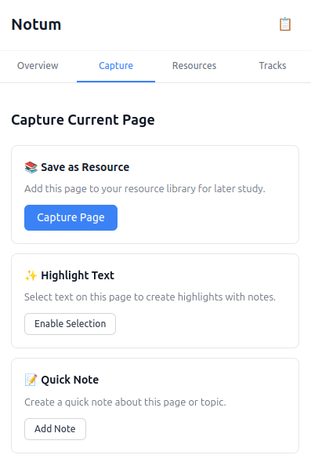

# Notum - Local-First Study Assistant Browser Extension


**Notum** is a privacy-focused, local-first browser extension designed for active studying, note-taking, and knowledge organization from web pages and videos. All data processing happens 100% on the client, ensuring complete privacy and user control.



## 🧰 Tech Stack


## 🌟 Features

### Core Functionality
- **📄 Web Page Capture**: Save full web pages as study resources
- **🎯 Text Highlighting**: Select and save important text passages
- **📝 Smart Notes**: Add contextual notes to highlights and resources
- **🌐 Client-Side Translation**: Translate content without sending data to servers
- **📚 Study Tracks**: Organize learning with predefined and custom study paths
- **🗃️ Flashcards**: Create spaced-repetition flashcards from highlights
- **📊 Progress Tracking**: Monitor study time and completion rates

### Privacy & Data Control
- **🔒 100% Local Processing**: No data sent to external servers
- **💾 Local Storage**: All data stored in IndexedDB on your device
- **📤 Export/Import**: Full control over your data with Markdown export
- **🔧 Open Source**: Transparent and auditable code

### Advanced Features
- **⚡ Web Workers**: Heavy processing without blocking the UI
- **🔄 Background Processing**: Content analysis and translation in background
- **📱 Cross-Browser Support**: Works on Chrome, Firefox, and other Chromium browsers
- **🎨 Modern UI**: Clean, intuitive React-based interface

## 🚀 Quick Start

### Installation

1. **Clone the repository:**
   ```bash
   git clone <repository-url>
   cd notum_extension
   ```

2. **Install dependencies:**
   ```bash
   npm install
   ```

3. **Build the extension:**
   ```bash
   npm run build
   ```

   **Firefox build (recommended for testing in Firefox):**
   ```bash
   npm run build:firefox
   ```

   **If Firefox shows “background.service_worker is currently disabled” (MV3 SW disabled), use MV2:**
   ```bash
   npm run build:firefox:mv2
   ```

4. **Load in browser:**
   - Open Chrome/Firefox and navigate to `chrome://extensions/` or `about:debugging`
   - Enable "Developer mode"
   - Chrome: Click "Load unpacked" and select the `dist` folder
   - Firefox: Go to `about:debugging#/runtime/this-firefox` → "Load Temporary Add-on…" → select `dist/manifest.json`

### Development

1. **Start development mode:**
   ```bash
   npm run dev
   ```

   **Firefox dev mode:**
   ```bash
   npm run dev:firefox
   ```

   **Firefox dev mode (MV2 fallback):**
   ```bash
   npm run dev:firefox:mv2
   ```
   
2. **Run the setup script:**
   ```bash
   ./scripts/setup-dev.sh
   ```

## 🏗️ Architecture

### Project Structure
```
src/
├── background/         # Background service worker
├── content/           # Content scripts for page interaction
├── ui/               # React components and UI
│   ├── popup/        # Extension popup
│   ├── sidepanel/    # Side panel interface
│   └── components/   # Reusable UI components
├── storage/          # IndexedDB services and data layer
├── workers/          # Web Workers for heavy processing
├── lib/              # Utilities and shared libraries
└── types/            # TypeScript type definitions
```

### Tech Stack
- **Frontend**: React + TypeScript
- **Storage**: IndexedDB with Dexie.js
- **Build**: Webpack + TypeScript
- **Extension**: Manifest V3
- **Processing**: Web Workers
- **Export**: JSZip for data export

## 📖 Usage Guide

### Capturing Content

1. **Full Page Capture**:
   - Click the extension icon
   - Go to "Capture" tab
   - Click "Capture Page"

2. **Text Highlighting**:
   - Select text on any webpage
   - Use context menu "Save to Notum"
   - Or enable selection mode from popup

3. **Translation**:
   - Select text to translate
   - Use context menu "Translate with Notum"
   - View translation overlay

### Managing Study Tracks

1. **Create Custom Track**:
   - Open side panel
   - Click "New Track"
   - Add resources and milestones

2. **Use Templates**:
   - Browse predefined templates
   - Duplicate and customize for your needs

3. **Track Progress**:
   - View completion percentages
   - Monitor study time
   - Complete milestones

## 🔧 Configuration

### Build Commands

| Command | Description |
|---------|-------------|
| `npm run dev` | Watch mode for development |
| `npm run build` | Production build |
| `npm run build:dev` | Development build |
| `npm run clean` | Clean build artifacts |
| `npm run type-check` | TypeScript type checking |
| `npm run lint` | ESLint code linting |
| `npm run test` | Run Jest tests |

## 🤝 Contributing

We welcome contributions! Please see [REQUIREMENTS.md](REQUIREMENTS.md) for detailed project specifications.

## 📜 License

This project is licensed under the MIT License - see the [LICENSE](LICENSE) file for details.
